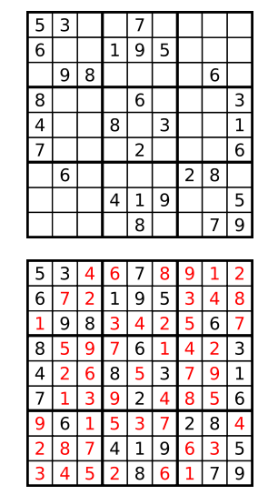

Problem
Sudoku is a popular single player game. The objective is to fill a 9x9 matrix with digits so that each column, each row, and all 9 non-overlapping 3x3 sub-matrices contain all of the digits from 1 through 9. Each 9x9 matrix is partially completed at the start of game play and typically has a unique solution.

Given a completed N2xN2 Sudoku matrix, your task is to determine whether it is a valid solution. A valid solution must satisfy the following criteria:

Each row contains each number from 1 to N2, once each.
Each column contains each number from 1 to N2, once each.
Divide the N2xN2 matrix into N2 non-overlapping NxN sub-matrices. Each sub-matrix contains each number from 1 to N2, once each.
You don't need to worry about the uniqueness of the problem. Just check if the given matrix is a valid solution.

Input
The first line of the input gives the number of test cases, T. T test cases follow. Each test case starts with an integer N. The next N2 lines describe a completed Sudoku solution, with each line contains exactly N2 integers. All input integers are positive and less than 1000.

Output
For each test case, output one line containing "Case #x: y", where x is the case number (starting from 1) and y is "Yes" (quotes for clarity only) if it is a valid solution, or "No" (quotes for clarity only) if it is invalid. Note that the judge is case-sensitive, so answers of "yes" and "no" will not be accepted.

Limits
Time limit: 30 seconds per test set.
Memory limit: 1GB.
1 ≤ T ≤ 100.

Test set 1 - Visible
N = 3.

Test set 2 - Hidden
3 ≤ N ≤ 6.

Sample
Sample input
`                                             
3                                                         
3                                                         
5 3 4 6 7 8 9 1 2                                         
6 7 2 1 9 5 3 4 8
1 9 8 3 4 2 5 6 7
8 5 9 7 6 1 4 2 3
4 2 6 8 5 3 7 9 1
7 1 3 9 2 4 8 5 6
9 6 1 5 3 7 2 8 4
2 8 7 4 1 9 6 3 5
3 4 5 2 8 6 1 7 9
3
1 2 3 4 5 6 7 8 9
1 2 3 4 5 6 7 8 9
1 2 3 4 5 6 7 8 9
1 2 3 4 5 6 7 8 9
1 2 3 4 5 6 7 8 9
1 2 3 4 5 6 7 8 9
1 2 3 4 5 6 7 8 9
1 2 3 4 5 6 7 8 9
1 2 3 4 5 6 7 8 9
3
5 3 4 6 7 8 9 1 2
6 7 2 1 9 5 3 4 8
1 9 8 3 4 2 5 6 7
8 5 9 7 6 1 4 2 3
4 2 6 8 999 3 7 9 1
7 1 3 9 2 4 8 5 6
9 6 1 5 3 7 2 8 4
2 8 7 4 1 9 6 3 5
3 4 5 2 8 6 1 7 9
`
Sample output
`
Case #1: Yes
Case #2: No
Case #3: No
`