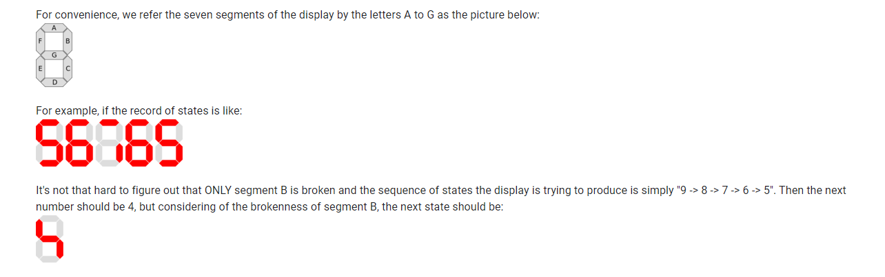

# Seven Segment Display

Problem
Tom is a boy whose dream is to become a scientist, he invented a lot in his spare time. He came up with a great idea several days ago: to make a stopwatch by himself! So he bought a seven-segment display immediately.

The seven elements of the display are all light-emitting diodes (LEDs) and can be lit in different combinations to represent the arabic numerals like:


However, just when he finished the programs and tried to test the stopwatch, some of the LEDs turned out to be broken! Some of the segments can never be lit while others worked fine. So the display kept on producing some ambiguous states all the time...

Tom has recorded a continuous sequence of states which were produced by the display and is curious about whether it is possible to understand what this display was doing. He thinks the first step is to determine the state which the display will show next, could you help him?

Please note that the display works well despite those broken segments, which means that the display will keep on counting down cyclically starting from a certain number (can be any one of 0-9 since we don't know where this record starts from). 'Cyclically' here means that each time when the display reaches 0, it will keep on counting down starting from 9 again.



Input
The first line of the input gives the number of test cases, T. Each test case is a line containing an integer N which is the number of states Tom recorded and a list of the N states separated by spaces. Each state is encoded into a 7-character string represent the display of segment A-G, from the left to the right. Characters in the string can either be '1' or '0', denoting the corresponding segment is on or off, respectively.

Output
For each test case, output one line containing "Case #x: y", where x is the test case number (starting from 1). If the input unambiguously determines the next state of the display, y should be that next state (in the same format as the input). Otherwise, y should be "ERROR!".

Limits
Time limit: 30 seconds per test set.
Memory limit: 1GB.
1 ≤ T ≤ 2000.

Small dataset (Test set 1 - Visible)
1 ≤ N ≤ 5.
Large dataset (Test set 2 - Hidden)
1 ≤ N ≤ 100.


Sample

Sample input

```
4
1 1111111
2 0000000 0001010
3 0100000 0000111 0000011
5 1011011 1011111 1010000 1011111 1011011
```

Sample output

```
Case #1: 1110000
Case #2: ERROR!
Case #3: 0100011
Case #4: 0010011
```